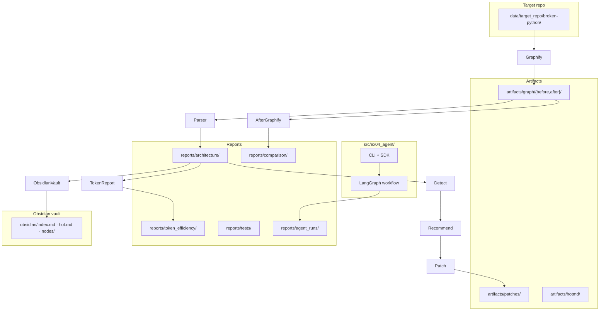
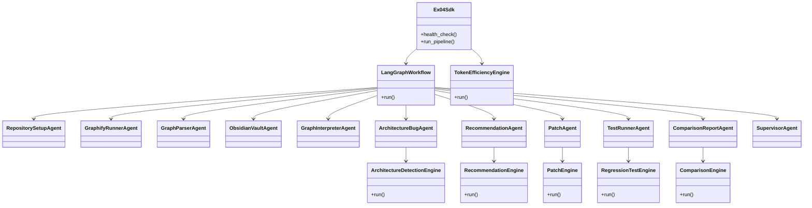
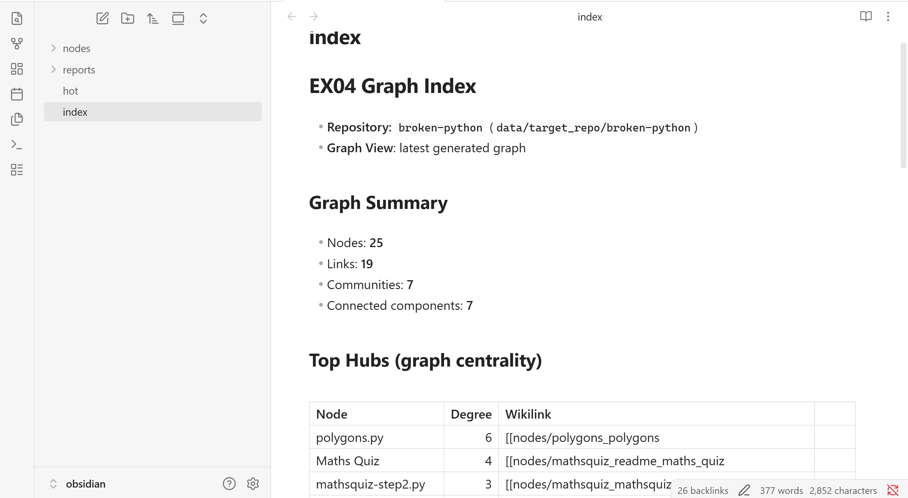
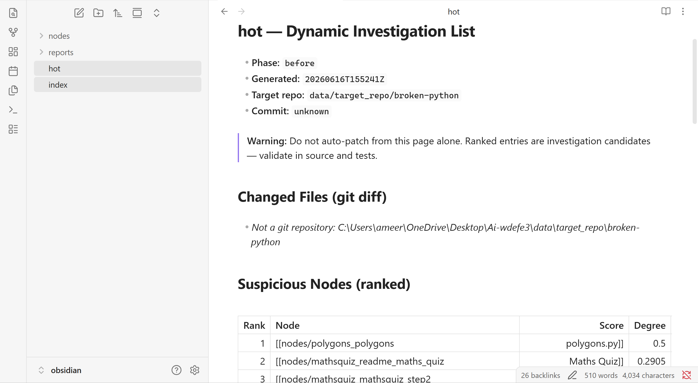
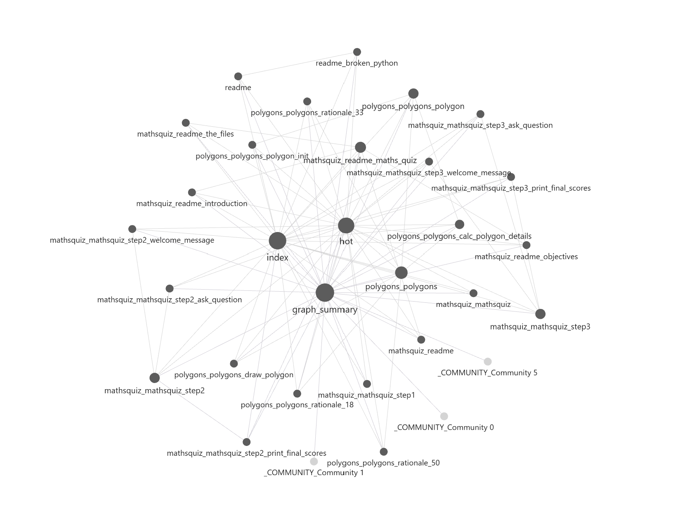
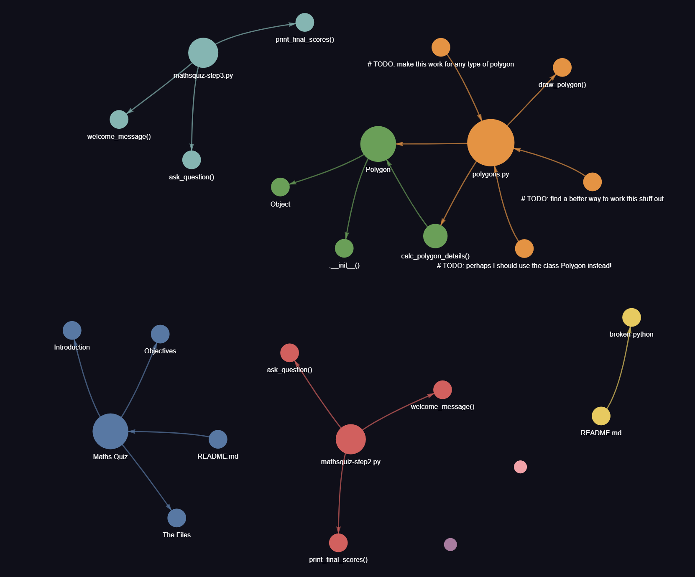
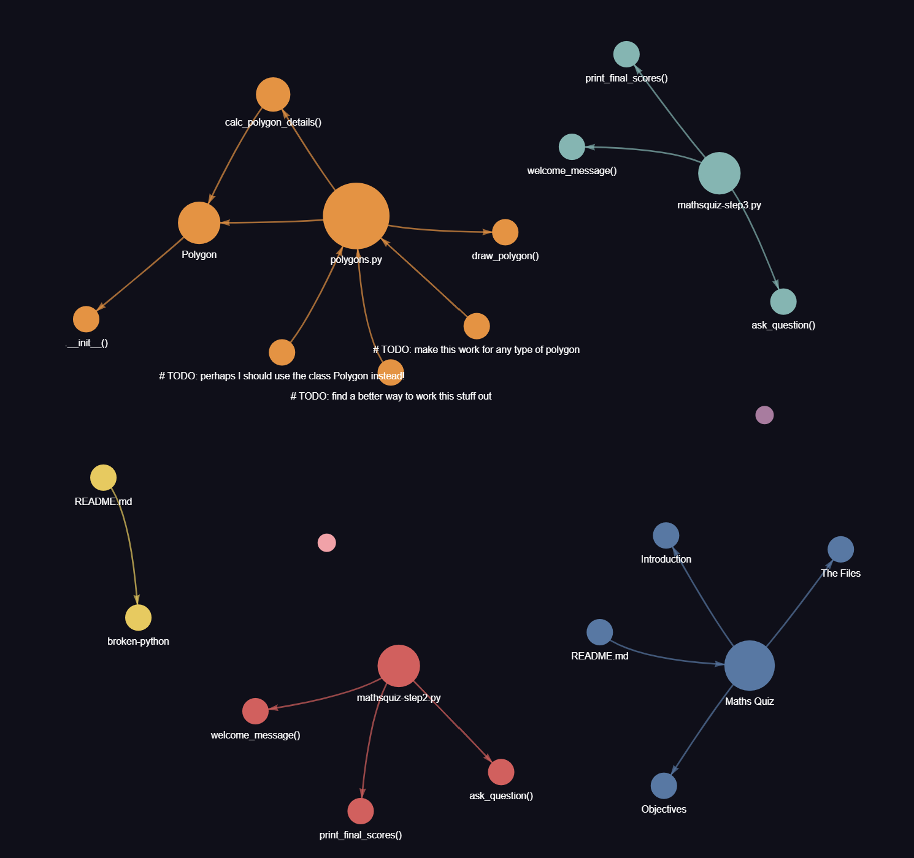

# Reverse Engineering Architecture with Graphify, Obsidian, and Multi-Agent Workflow

**EX04 — AI Agents (Dr. Yoram Segal)**  
**Package:** `ex04-agent` · **Target:** [martinpeck/broken-python](https://github.com/martinpeck/broken-python)

---

## 1. Repository choice

**Target repo:** `martinpeck/broken-python` (cloned to `data/target_repo/broken-python/`).

We chose this repo because it is a **small, unfamiliar Python teaching project** with intentional syntax errors, legacy Python 2 patterns, mixed tutorial evolution (multiple mathsquiz steps), and architecture smells — ideal for demonstrating graph-guided reverse engineering and code-health detection without needing a large production codebase.

**Honest limitation:** this is a **small teaching repo**. Graph metrics and findings are evidence for investigation, not proof of enterprise-scale architecture quality.

---

## What to inspect first

| What to inspect | Path |
| --- | --- |
| Final README/report | `README.md` |
| Obsidian navigation | `obsidian/index.md`, `obsidian/hot.md` |
| Graphify before/after | `artifacts/graph/before/`, `artifacts/graph/after/` |
| Agent workflow traces | `reports/agent_runs/` |
| Architecture findings before/after | `reports/architecture/findings_before.md`, `reports/architecture/findings_after.md` |
| Recommendations and patch plan | `reports/architecture/recommendations_before.md`, `reports/architecture/patch_plan_before.md` |
| Safe patch result | `reports/architecture/patch_result_before.md` |
| Validation report | `reports/tests/regression_before.md` |
| Before/after comparison | `reports/comparison/before_after.md` |
| Token-efficiency proof | `reports/token_efficiency/token_efficiency.md` |

---

## 2. Research questions

Assignment research questions mapped to method, evidence, and results:

| Research question | Method | Evidence | Result |
| --- | --- | --- | --- |
| **1.** What is the actual architecture of the project, and what appears only after reverse engineering instead of from first glance? | Graphify AST graph → metrics → Obsidian vault → architecture story | `artifacts/graph/before/graph.json`, `reports/architecture/metrics_before.json`, `obsidian/index.md`, `reports/architecture/story_before.md` | **26 nodes / 20 links** before patch; disconnected tutorial components, hub candidates, and syntax-blocked files visible only after graph + source scan — not from README alone |
| **2.** Which components, modules, classes, or functions are most central in the system? | Degree/betweenness metrics, top hubs, Obsidian node pages | `reports/architecture/metrics_before.json`, `obsidian/hot.md`, `obsidian/nodes/` | **Possible hubs:** `polygons.py`, mathsquiz step files, Maths Quiz doc region — graph suggests centrality; source validation required |
| **3.** Are there complexity centers, overloaded responsibility points, or possible “God Nodes”? | God-node detector + mixed-responsibility detector + metrics | `reports/architecture/findings_before.md` | **Candidate** mixed responsibility in `polygons.py`; **possible** code hub candidates in mathsquiz steps — not confirmed god-nodes without manual review |
| **4.** How can we derive an architecture block diagram and OOP/class diagram from the source when documentation is incomplete? | Graphify extraction + our agent OOP design + Mermaid diagrams in this README | README §3 block diagram, README OOP class diagram, `artifacts/graph/before/graph.html` | Block diagram shows pipeline modules; class diagram shows **our solution’s** agent/engine separation (target repo is small — e.g. `Polygon` class only) |
| **5.** How did the agent identify the bug/code-health problem, what was the root cause, and what steps led to it? | Deterministic detectors + recommendation loop + safe patch | `reports/architecture/findings_before.md`, `reports/architecture/recommendations_before.md`, `reports/architecture/patch_result_before.md` | Syntax blockers (Python 2 / invalid syntax), hidden globals, import-time side effects identified; **4 safe local fixes** applied; root causes documented per file in §Code repair proof |
| **6.** What is the benefit of graph visualization and Obsidian navigation vs reading files linearly? | Obsidian vault + hot.md ranking + graph view | `obsidian/index.md`, `obsidian/hot.md`, `obsidian/nodes/` | Non-linear navigation to hub **candidates** and linked evidence; `hot.md` prioritizes investigation targets vs reading all 7 source files |
| **7.** How did graph-guided context reduce AI context/token usage vs naive full-context workflow? | Token-efficiency engine: naive bundles vs graph-guided bundles | `reports/token_efficiency/token_efficiency.md`, `reports/comparison/before_after.md` | **211,532 → 42,568** estimated tokens (**79.88%** saved); graph-guided bundles use hot.md, metrics, affected files — see §Token-efficiency report |
| **8.** What original extensions or extra agent mechanisms were added beyond the minimum? | Dynamic hot.md, deterministic detectors, safe patcher, comparison guard, token bundles, agent traces | `artifacts/hotmd/`, `reports/comparison/before_after.md`, `reports/token_efficiency/token_efficiency.md` | Git-diff-aware **dynamic hot.md**; read-only before/after comparison; token-efficiency analysis; one-responsibility agents — see §Original extensions |

---

## 3. System architecture

### Architecture block diagram

The diagram below satisfies the **architecture block diagram** requirement (§5.3). It shows how the target repo is **analyzed, not trusted from its README alone**:

- **Target repo** → Graphify produces graph artifacts.
- **Parser / metrics / Obsidian / detection / recommendation / patch / testing / comparison / token** modules are **separate blocks** in `src/ex04_agent/`.
- **Reports and artifacts** form the evidence layer (findings, patches, regression, comparison, token efficiency).



| Path | Role |
| --- | --- |
| `src/ex04_agent/` | Python package: agents, graph parser, detection, patching, comparison, token analysis |
| `docs/` | PRD, PLAN, TODO, planning traceability |
| `reports/` | Architecture, tests, comparison, token efficiency, agent traces, phase reports |
| `artifacts/` | Graphify output, patch diffs/backups, hot.md snapshots |
| `obsidian/` | Generated vault for human navigation (`index.md`, `hot.md`, node pages) |
| `data/target_repo/broken-python/` | Cloned target (patched during the safe repair step; tooling runs are read-only on frozen before/after evidence) |
| `config/setup.json` | Project configuration (no secrets) |

### OOP/Class diagram

This is the **OOP/system-level class view of our solution** (`ex04-agent`), not the target repo. The target repo is small and contains classes/functions such as `Polygon` in `polygons.py`. The important OOP idea here is **separation of agent responsibilities** and **service engines** behind thin agents.



---

## 4. Multi-agent workflow

End-to-end workflow (what the project actually does):

**Graphify (before) → Obsidian knowledge base → findings → recommendations → patch plan → safe repair → validation → Graphify (after) → comparison → token-efficiency analysis**

Linear **LangGraph** pipeline (`uv run ex04-agent pipeline --dry-run --phase before|after`). Traces: `reports/agent_runs/<timestamp>/`.

| Agent | Responsibility |
| --- | --- |
| **RepositorySetupAgent** | Verify target repo exists; record metadata |
| **GraphifyRunnerAgent** | Run Graphify CLI; collect `graph.json`, HTML, report |
| **GraphParserAgent** | Parse graph → architecture metrics JSON |
| **ObsidianVaultAgent** | Build Obsidian vault (`index.md`, node pages, graph summary) |
| **DynamicHotMd** | Rank nodes (metrics + git diff); write dynamic `hot.md` |
| **GraphInterpreterAgent** | Write architecture story markdown from metrics |
| **ArchitectureBugAgent** | Run deterministic detectors → findings JSON/MD |
| **RecommendationAgent** | Map findings → recommendations + patch plan |
| **PatchAgent** | Apply safe whitelisted patches (with backups/diffs) |
| **TestRunnerAgent** | Compile/AST/import/project pytest/coverage/Ruff regression |
| **ComparisonReportAgent** | Before/after comparison (read-only on frozen artifacts) |
| **SupervisorAgent** | Set pipeline stop reason |

After a repair run, a dry-run pipeline can run **comparison only** (skips regenerating graph/findings) when before and after artifacts already exist — preserving frozen evidence.

---

## 5. Graphify + Obsidian reverse engineering

Graphify produced a **graph-based view of the code** (nodes = functions/classes/files, links = relationships) — not just a file list. The **Obsidian vault** is a structured **knowledge base** with cross-linked pages, not merely generated Markdown dumped in a folder.

| Obsidian artifact | Purpose |
| --- | --- |
| `obsidian/index.md` | Main navigation page showing graph summary and key links |
| `obsidian/hot.md` | Focused investigation page ranking important **candidates** |
| `obsidian/nodes/` | Per-node pages for hubs, source files, and graph entities |
| `obsidian/reports/graph_summary.md` | Human-readable graph summary |
| `artifacts/graph/before/graph.html` | Graphify visual output before repair |
| `artifacts/graph/after/graph.html` | Graphify visual output after repair |

**Non-linear reading path:** hub page → source file node → finding → recommendation (instead of reading every `.py` file in order).

### Workflow steps

1. **Graphify (before):** `graphify update .` → `artifacts/graph/before/` (**26 nodes, 20 links**).
2. **Metrics parser:** `metrics_before.json` — degree, hubs, communities, god-node **candidates**.
3. **Obsidian vault:** `index.md` (navigation), dynamic **`hot.md`** (ranked **candidates**), `nodes/*.md` for top hubs.
4. **Architecture detection:** findings combine graph metrics with read-only source scans.
5. **Graphify (after repair):** `--force` rerun → `artifacts/graph/after/` (**25 nodes, 19 links**).

**Screenshots from Obsidian are still manual** and must be added under `assets/screenshots/` before final submission.

### Screenshot placeholders (manual capture required)

Screenshots are **not auto-generated**. They must be captured manually for the lecturer (Obsidian → evidence in README).

1. Open **Obsidian**.
2. Open vault folder: `C:\Users\ameer\OneDrive\Desktop\Ai-wdefe3\obsidian`
3. Capture and save under `assets/screenshots/`:
   - `obsidian_index.png` — `index.md`
   - `obsidian_hot.png` — `hot.md`
   - `obsidian_graph_view.png` — Obsidian graph view (Ctrl+G)
   - `graphify_before.png` — open `artifacts/graph/before/graph.html` in browser
   - `graphify_after.png` — open `artifacts/graph/after/graph.html` in browser
4. After PNGs exist, GitHub README will display the images below.

**After screenshots are added**, these links will render in GitHub:







See also: `assets/screenshots/README.md`

---

## 6. Before architecture findings

| Metric | Value |
| --- | ---: |
| Graph (before) | **26 nodes / 20 links** |
| Findings | **19** |
| Recommendations | **19** |

**Top issues (careful wording — candidates validated by source where noted):**

- **Possible** mixed responsibilities in `polygons.py` (graph suggests hub; source confirms turtle drawing + calculation mix).
- **Code-health blockers:** syntax errors in `mathsquiz/mathsquiz.py` and `polygons/polygons.py` (validated by compile/AST).
- **Possible** hidden global state in mathsquiz step files (graph + source pattern).
- **Possible** top-level script/import mixing (side effects at import time).
- Multiple disconnected/tutorial components and evolution versions (mathsquiz-step1/2/3 coexist).
- Documentation/knowledge hub candidate: Maths Quiz README region.

Language: findings use *candidate*, *possible*, *graph suggests* — confirmed where compile/AST or source scan applies.

---

## Recommendations and patch plan

After **19 findings**, `RecommendationAgent` produced **19 recommendations** before any patching (`reports/architecture/recommendations_before.json`).

### Action type breakdown

| Action type | Count | Meaning in this project |
| --- | ---: | --- |
| `review_required` | **16** | Human or agent should validate before changing code — **not** “unsafe to fix,” but “do not patch blindly” |
| `docs_only` | **3** | Documentation/navigation guidance; no code change expected |
| `safe_auto` | **0** | No fully automated recipes for this repo in the recommendation step |
| `defer` | **0** | Nothing explicitly deferred |

**Important:** `review_required` means the system should **not** apply changes without validation against graph + source evidence. The safe repair step selected only **small, safe, local code-health fixes** from the recommendation and patch plan — not every recommendation became a patch.

### Top 5 recommendations (before patch)

1. **Syntax blocker** in `mathsquiz/mathsquiz.py` (validated by compile/AST).
2. **Syntax blocker** in `polygons/polygons.py` (validated by compile/AST).
3. **Possible mixed responsibility** in `polygons.py` (graph suggests hub; source shows drawing + calculation mix) — **remaining manual review**.
4. **Possible top-level execution** in `polygons/polygons.py` (import/script mixing candidate).
5. **Possible top-level execution / hidden-state issues** in mathsquiz step files (`mathsquiz-step2.py`, `mathsquiz-step3.py`).

Structural refactors (e.g. splitting `polygons.py` into modules) and **docs-only** recommendations were **intentionally not patched** during safe repair. The patch plan grouped safe items separately from manual-review architecture work.

**Evidence:**

- `reports/architecture/recommendations_before.md`
- `reports/architecture/patch_plan_before.md`

---

## 7. Safe patch and repair process

The safe repair step **did not apply all 19 recommendations**. It applied only **whitelisted, minimal, reversible code-health fixes** that had deterministic recipes. The patcher wrote **backups and diffs before changing any file** so each change could be audited or rolled back.

**Why this matters:** safe agentic repair should avoid aggressive architecture rewrites on an unfamiliar teaching repo. Patching every recommendation would mix syntax fixes with structural refactors the system is not authorized to perform automatically.

**4 whitelisted files patched** with `--allow-patches`:

| File | Safe changes applied |
| --- | --- |
| `mathsquiz/mathsquiz.py` | Python 3 syntax (`print`), comparison fixes, score handling |
| `polygons/polygons.py` | Invalid base class removed, invalid constructor usage fixed, `if __name__ == "__main__":` guard |
| `mathsquiz/mathsquiz-step2.py` | `print_final_scores` uses parameter instead of global `score`; main guard |
| `mathsquiz/mathsquiz-step3.py` | Parameter-based score/percentage in `print_final_scores`; main guard |

**Results:** **4 applied**, **0 failed**, **0 rolled back**. Backups: `artifacts/patches/before/backups/`. Diffs: `artifacts/patches/before/diffs/`.

The architecture is **not fully fixed** — only targeted code-health blockers and related side-effect/globals issues addressed. Hub candidates, mixed responsibility, and documentation findings remain for manual review.

Evidence: `reports/architecture/patch_result_before.json`

---

## Code repair and validation proof

| Item | Detail |
| --- | --- |
| **Problem** | Broken target repo: syntax errors, invalid class definitions, hidden global state, tutorial duplication |
| **Root cause (validated by source)** | `mathsquiz.py` had syntax/code-health blockers; `polygons.py` had invalid class/constructor/main-script issues; `mathsquiz-step2.py` and `mathsquiz-step3.py` had hidden global-state issues |
| **Fix (safe local repair)** | 4 whitelisted patches applied; 0 failed; 0 rolled back |
| **Validation** | `compile`, AST parse, project test suite (**144 passed**), coverage (**89.86%**), Ruff (**clean**). Target-repo tests were **skipped honestly** because `martinpeck/broken-python` has no test suite |
| **Before/after effect** | Findings **19 → 8**; recommendations **19 → 8**; graph **26/20 → 25/19** nodes/links |

This section answers: **what was the problem, why was it bad, root cause, exact fix, validation, and after-state.**

### Problem summary

The target repo contained **legacy/broken tutorial Python** — Python 2 syntax, invalid class usage, hidden globals, and top-level script execution. These are **code-health blockers** and side-effect risks, not merely style issues. The graph **suggests** hub files; source validation confirmed syntax and global-state patterns.

### Per-file repair table

| File | Problem | Root cause | Fix | Validation |
| --- | --- | --- | --- | --- |
| `mathsquiz/mathsquiz.py` | Syntax blocker, Python 2 `print`, assignment in `if` | Legacy/broken tutorial code | Python 3 `print`, comparisons, score handling | compile + AST + regression |
| `polygons/polygons.py` | Invalid base class, invalid `new`, top-level execution | Mixed script/class design and non-Python syntax | Class fix, constructor fix, `main` guard | compile + AST + regression |
| `mathsquiz-step2.py` | Hidden global state, top-level execution | Function parameter ignored; script runs on import | Use `final_score` parameter, main guard | compile + AST + regression |
| `mathsquiz-step3.py` | Hidden global state, percentage from global, top-level execution | Function parameter ignored | Use parameters, main guard | compile + AST + regression |

### Patch and validation evidence

- Backups/diffs: `artifacts/patches/before/backups/`, `artifacts/patches/before/diffs/`
- Patch result: `reports/architecture/patch_result_before.md`
- Regression: `reports/tests/regression_before.md`
- **4 applied, 0 failed, 0 rolled back** — safe local repair only; not all 19 recommendations were patched.

### Before/after proof (findings)

| Metric | Before | After |
| --- | ---: | ---: |
| Findings | **19** | **8** |
| Code-health blockers | 2 | **0** |
| Hidden global state findings | 7 | **0** |
| Import/script mixing findings | 2 | **0** |

Remaining **8** findings are manual-review, hub **candidates**, and documentation/navigation items — **not** failed patching. The architecture is **not fully fixed**.

---

## 8. Regression and validation after repair

| Check | Status |
| --- | --- |
| Compile (target `.py`) | Passed |
| AST parse | Passed |
| Safe import | Skipped (GUI/input heuristics) |
| Target repo tests | **Skipped honestly** — no test suite in broken-python |
| Project pytest | Passed (144 tests) |
| Coverage | Passed (89.86%) |
| Ruff | Passed |

Reports: `reports/tests/regression_before.json`, `regression_after.json`

---

## 9. After architecture & before/after comparison

| Metric | Before | After |
| --- | ---: | ---: |
| Graph nodes / links | 26 / 20 | **25 / 19** |
| Findings | 19 | **8** |
| Recommendations | 19 | **8** |
| Code-health blockers | 2 | **0** |
| Hidden-global findings | 7 | **0** |
| Import/script mixing | 2 | **0** |

### Category impact (findings)

| Area | Before | After | Meaning |
| --- | ---: | ---: | --- |
| Code-health blockers | 2 | 0 | Syntax/import blockers cleared after safe patches |
| Hidden global state | 7 | 0 | Parameter/global mismatch removed in step files |
| Import/script mixing | 2 | 0 | Main guards reduced top-level side effects |
| Mixed responsibility | 1 | 1 | **Still needs manual refactor** — not auto-patched |
| Possible hubs | 4 | 4 | Graph still points to central files (candidates) |
| Docs / navigation / organization | 3 | 3 | Expected in a small teaching repo |

**Recommendations after patching:** dropped from **19 → 8**. The remaining **8** are mainly manual-review, hub-candidate, or documentation/navigation items. This is **expected** because safe repair intentionally avoided aggressive architecture refactoring.

**What improved:** syntax blockers cleared; hidden-global and top-level side-effect findings no longer detected on patched code.

**What remains (remaining manual review):** mixed-responsibility **candidate** in `polygons.py`; hub **candidates**; documentation/navigation/organization findings; disconnected components; multiple mathsquiz tutorial versions.

**Graph metric decrease:** the graph became slightly smaller (−1 node, −1 link). This is **supporting evidence** that invalid/obsolete structure may have been removed — **not automatic proof** of better architecture. Interpret together with findings and tests. Not all bugs were solved.

### What was not fixed on purpose

- **`polygons.py` mixed responsibility** — splitting drawing, domain logic, and input into separate modules is a larger refactor; left for human design review.
- **Multiple mathsquiz step files** — may be intentional teaching evolution; not merged or deleted automatically.
- **Documentation/knowledge hub** — README and wiki-style nodes are navigation evidence, not code defects.
- **Disconnected graph components** — normal for a small repo with separate tutorial examples.

### Evidence for the recommendation loop

End-to-end chain (each step preserved as a report):

```
findings_before → recommendations_before → patch_plan_before → patch_result_before
  → regression_before → graph_after → findings_after → recommendations_after → before_after
```

| Step | Report path |
| --- | --- |
| Findings (before) | `reports/architecture/findings_before.md` |
| Recommendations (before) | `reports/architecture/recommendations_before.md` |
| Patch plan (before) | `reports/architecture/patch_plan_before.md` |
| Patch result | `reports/architecture/patch_result_before.md` |
| Regression | `reports/tests/regression_before.md` |
| Graph (after) | `artifacts/graph/after/graph.json` |
| Findings (after) | `reports/architecture/findings_after.md` |
| Recommendations (after) | `reports/architecture/recommendations_after.md` |
| Before/after comparison | `reports/comparison/before_after.md` |

Full comparison JSON: `reports/comparison/before_after.json`

---

## Knowledge-level before/after proof

Assignment requirement: show before/after at **knowledge level** — pages, graphs, links, Obsidian insights.

### Before (initial reverse-engineering knowledge)

- Graphify before graph: **26 nodes / 20 links** (`artifacts/graph/before/graph.json`)
- Obsidian `index.md` + `hot.md` generated for investigation navigation
- **19 findings**, **19 recommendations** — syntax blockers, hidden globals, hub **candidates**, mixed-responsibility **candidate**
- Node pages link graph nodes to evidence snippets

### After (post safe-patch knowledge)

- Graphify after graph: **25 nodes / 19 links** (`artifacts/graph/after/graph.json`)
- Findings reduced to **8**; recommendations reduced to **8**
- Code-health blockers cleared; globals/side-effect patterns addressed in patched files
- `reports/comparison/before_after.md` explains what changed and what remains

### Obsidian contribution

- **`index.md`** — navigation overview across vault sections
- **`hot.md`** — ranked investigation **candidates** (metrics + git-diff weights)
- **Node pages** — per-node links, affected files, graph context
- **Graph view** — non-linear navigation vs reading files linearly (screenshot: `assets/screenshots/obsidian_graph_view.png`)

Graph metric decrease is **supporting evidence**, not proof that all architecture issues were solved.

---

## Token-efficiency and graph-guided context report

Token counts are **deterministic estimates** using `ceil(character_count / 4)`, **not** provider billing.

| Metric | Value |
| --- | ---: |
| Baseline (naive) | **211,532** estimated tokens |
| Graph-guided | **42,568** estimated tokens |
| **Saved** | **168,964 estimated tokens (79.88%)** |

### Scenario comparison

| Scenario | Naive/baseline context | Graph-guided context | Baseline tokens | Graph-guided tokens | Saved | Why graph helped |
| --- | --- | --- | ---: | ---: | ---: | --- |
| Architecture detection | Full repo + graph/report dump | `hot.md`, metrics, top node pages, selected source files | 81,546 | 8,369 | 89.7% | Focused on hubs and suspected files |
| Recommendation generation | All findings/reports/source | Findings JSON + affected files | 81,546 | 9,422 | 88.4% | Structured findings instead of rereading all code |
| Before/after comparison | All architecture reports | Metrics/findings/recommendations before+after + patch/regression | 48,440 | 24,777 | 48.9% | Compared structured artifacts directly |
| **Total** | Combined baseline | Combined graph-guided | **211,532** | **42,568** | **79.88%** | Graph-guided context removed irrelevant reading |

### Proof dimensions (instructor checklist)

| Proof dimension | Naive mode | Graph-guided mode |
| --- | --- | --- |
| **Tokens** | 211,532 | 42,568 |
| **Files/text units** | Many raw files + raw graph/report dump | Focused bundles: `index.md`, `hot.md`, metrics, selected node pages, affected files |
| **Research iterations** | More manual scanning required | Pipeline stages: Graphify → metrics → hot.md → findings → recommendations |
| **Root-cause speed** | Slower — linear file reading | Faster — hot.md and graph hubs pointed to `mathsquiz.py`, `polygons.py`, step files |
| **Quality risk** | High noise, more irrelevant context | Lower noise; still requires **source validation** |
| **Limitation** | Simple but expensive on large repos | Best on larger repos; on this small repo raw source-only context is already small (~2.9k tokens) |

### Estimation honesty

- Method: `estimated_tokens = ceil(character_count / 4)`
- **Not** real billing tokens; **no** external provider token logs
- Small teaching repo — graph/report JSON can exceed raw source size
- Primary benefit: **focus and traceability**, not only raw byte reduction

Report: `reports/token_efficiency/token_efficiency.md`

---

## Original extensions and group contribution

These extensions were added to make the project more than a simple script. They show how graph-guided agents can focus investigation, preserve evidence, and avoid unsafe automatic refactoring.

### 1. Dynamic `hot.md`

- Ranks important nodes using graph metrics (degree, betweenness, hub/god-node flags).
- Also supports **git-diff proximity** (changed files rank higher).
- Saves snapshots under `artifacts/hotmd/` (`hot_before_*.md`, `hot_after_*.md`).
- Command: `uv run ex04-agent hotmd --phase before`

### 2. Deterministic architecture detectors

- Detects possible hubs, mixed responsibility, top-level execution, hidden global state, syntax blockers, disconnected components, and tutorial duplication.
- Does **not** use fake LLM claims — findings cite graph metrics and read-only source scans.

### 3. Safe patcher with backups and diffs

- Only **whitelisted** target files.
- **Dry-run by default**; apply only with `--allow-patches`.
- Rollback-aware design; diffs and backups saved under `artifacts/patches/before/`.

### 4. Read-only before/after comparison guard

- Prevents comparison from overwriting **before** artifacts when both before and after evidence exist.
- Keeps before and after evidence frozen for the lecturer.

### 5. Token-efficiency bundles

- Compares naive full-repo context to graph-guided context bundles.
- Reports estimated token savings and **limitations** (see §Token-efficiency report).

### 6. Agent traceability

- Agent run traces under `reports/agent_runs/<timestamp>/`.
- Each agent has **one responsibility** in the LangGraph workflow.

---

## 12. How to run

```bash
# Setup
uv sync
uv run ex04-agent health

# Before graph/analysis run
uv run ex04-agent graphify --phase before
uv run ex04-agent parse --phase before
uv run ex04-agent obsidian --phase before --dynamic-hot
uv run ex04-agent detect --phase before
uv run ex04-agent recommend --phase before
uv run ex04-agent patch --phase before                    # dry-run
uv run ex04-agent patch --phase before --allow-patches      # apply patches
uv run ex04-agent test --phase before

# After repair graph/analysis run
uv run ex04-agent graphify --phase after
uv run ex04-agent parse --phase after
uv run ex04-agent detect --phase after
uv run ex04-agent recommend --phase after

# Analysis reports (read-only on existing artifacts)
uv run ex04-agent compare
uv run ex04-agent token-report

# Quality gates
uv run pytest
uv run pytest --cov=src --cov-report=term-missing
uv run ruff check

# Full pipeline (dry-run)
uv run ex04-agent pipeline --dry-run --phase before
uv run ex04-agent pipeline --dry-run --phase after   # comparison-only when artifacts exist
```

---

## 13. Evidence map

| Requirement | Evidence path |
| --- | --- |
| Graphify before/after | `artifacts/graph/before/`, `artifacts/graph/after/` |
| Obsidian vault | `obsidian/index.md`, `obsidian/hot.md`, `obsidian/nodes/` |
| Agent traces | `reports/agent_runs/` |
| Findings | `reports/architecture/findings_before.json`, `findings_after.json` |
| Recommendations | `reports/architecture/recommendations_before.json`, `recommendations_after.json` |
| Patch plan | `reports/architecture/patch_plan_before.json` |
| Patch diffs/backups | `artifacts/patches/before/diffs/`, `backups/` |
| Patch result | `reports/architecture/patch_result_before.json` |
| Regression | `reports/tests/regression_before.json` |
| Before/after comparison | `reports/comparison/before_after.json`, `.md` |
| Token efficiency | `reports/token_efficiency/token_efficiency.json`, `.md` |
| Phase reports | `reports/**/phase*_report.md` |
| Final checklist | `reports/final/final_submission_checklist.md` |

---

## Requirement coverage checklist

| Requirement | Status | Evidence |
| --- | --- | --- |
| Full GitHub repo with Python solution | Done | `src/`, `tests/`, `pyproject.toml`, `uv.lock` |
| LangGraph agent workflow | Done | `src/ex04_agent/workflow/`, `reports/agent_runs/` |
| Graphify outputs | Done | `artifacts/graph/before/`, `artifacts/graph/after/` |
| Obsidian vault with linked Markdown | Done | `obsidian/index.md`, `obsidian/hot.md`, `obsidian/nodes/` |
| Bug analysis with root cause and fix | Done | `reports/architecture/findings_before.md`, `patch_result_before.md` |
| Token comparison baseline vs graph-guided | Done | `reports/token_efficiency/token_efficiency.md` |
| Architecture block diagram | Done | README §3 — Architecture block diagram |
| OOP diagram | Done | README §3 — OOP/Class diagram |
| Before/after proof | Done | `reports/comparison/before_after.md` |
| Extensions/original ideas | Done | Dynamic `hot.md`, deterministic detectors, safe patcher, comparison guard, token bundles — see §Original extensions |
| Screenshots/visuals | Pending manual capture | `assets/screenshots/README.md` |

---

## 14. Limitations

- **Small teaching repo** — results do not generalize to large systems without re-validation.
- **No target test suite** — regression skips target tests honestly.
- **Graphify AST-only mode** — graph reflects extracted structure, not runtime behavior.
- **Graph evidence ≠ final proof** — always validate in source.
- **Deterministic analysis only** — no LLM API used for detection, recommendation, or patching in this submission.
- **Token figures are estimates** — not OpenAI/provider billing counts.

---

## 15. Submission checklist

- [x] Tests pass (`144`)
- [x] Coverage ≥ 85% (`89.86%`)
- [x] Ruff clean
- [x] No secrets — `.env-example` only
- [x] `uv.lock` exists
- [x] `.venv` not committed
- [ ] Obsidian screenshots captured → `assets/screenshots/` (manual — see TODO above)
- [ ] Final clean zip created (exclude `.venv/`, caches, `.coverage`, `*.zip`)

Zip instructions: `reports/final/final_submission_checklist.md`

---

## Planning & reports

- Planning: `docs/PRD.md`, `docs/PLAN.md`, `docs/TODO.md`
- Concise summary: `reports/final/final_summary.md`
