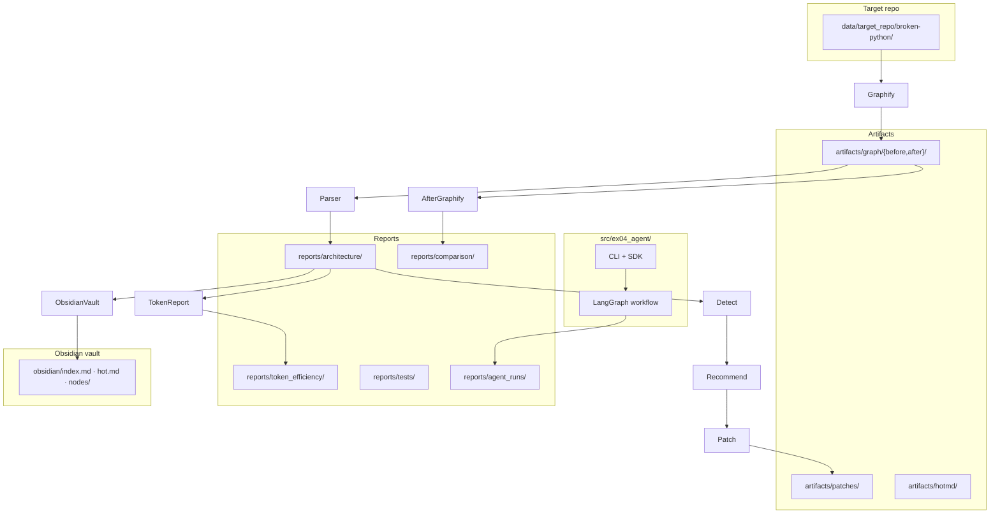

# Reverse Engineering Architecture with Graphify, Obsidian, and Multi-Agent Workflow

**EX04 — AI Agents (Dr. Yoram Segal)**  
**Package:** `ex04-agent` · **Target:** [martinpeck/broken-python](https://github.com/martinpeck/broken-python)

---

## 1. Repository choice

**Target repo:** `martinpeck/broken-python` (cloned to `data/target_repo/broken-python/`).

We chose this repo because it is a **small, unfamiliar Python teaching project** with intentional syntax errors, legacy Python 2 patterns, mixed tutorial evolution (multiple mathsquiz steps), and architecture smells — ideal for demonstrating graph-guided reverse engineering and code-health detection without needing a large production codebase.

**Honest limitation:** this is a **small teaching repo**. Graph metrics and findings are evidence for investigation, not proof of enterprise-scale architecture quality.

---

## 2. Research questions

| Question | How we addressed it |
| --- | --- |
| What architecture does the code actually have? | Graphify AST graph + metrics + Obsidian vault + graph story |
| What architecture/code-health issues exist? | Deterministic detectors on graph + source (`ArchitectureBugAgent`) |
| Can agents use Graphify/Obsidian to focus analysis? | `index.md`, `hot.md`, node pages, hub-ranked source selection |
| Can safe patches reduce findings? | Phase 10 whitelisted patches + after-phase Graphify rerun |
| Does graph-guided context reduce estimated token use? | Phase 14 token-efficiency report (naive vs graph-guided bundles) |

---

## 3. System architecture



| Path | Role |
| --- | --- |
| `src/ex04_agent/` | Python package: agents, graph parser, detection, patching, comparison, token analysis |
| `docs/` | PRD, PLAN, TODO, planning traceability |
| `reports/` | Architecture, tests, comparison, token efficiency, agent traces, phase reports |
| `artifacts/` | Graphify output, patch diffs/backups, hot.md snapshots |
| `obsidian/` | Generated vault for human navigation (`index.md`, `hot.md`, node pages) |
| `data/target_repo/broken-python/` | Cloned target (patched in Phase 10; not modified in Phases 12–15 tooling) |
| `config/setup.json` | Project configuration (no secrets) |

---

## 4. Multi-agent workflow

Linear **LangGraph** pipeline (`uv run ex04-agent pipeline --dry-run --phase before|after`). Traces: `reports/agent_runs/<timestamp>/`.

| Agent | Responsibility |
| --- | --- |
| **RepositorySetupAgent** | Verify target repo exists; record metadata |
| **GraphifyRunnerAgent** | Run Graphify CLI; collect `graph.json`, HTML, report |
| **GraphParserAgent** | Parse graph → architecture metrics JSON |
| **ObsidianVaultAgent** | Build Obsidian vault (`index.md`, node pages, graph summary) |
| **DynamicHotMd** | Rank nodes (metrics + git diff); write dynamic `hot.md` |
| **GraphInterpreterAgent** | Write architecture story markdown from metrics |
| **ArchitectureBugAgent** | Run deterministic detectors → findings JSON/MD |
| **RecommendationAgent** | Map findings → recommendations + patch plan |
| **PatchAgent** | Apply safe whitelisted patches (with backups/diffs) |
| **TestRunnerAgent** | Compile/AST/import/project pytest/coverage/Ruff regression |
| **ComparisonReportAgent** | Before/after comparison (read-only on frozen artifacts) |
| **SupervisorAgent** | Set pipeline stop reason |

After-phase dry-run skips artifact regeneration when before/after files exist and runs comparison only (Phase 13 guard).

---

## 5. Graphify + Obsidian reverse engineering

1. **Graphify (before):** `graphify update .` on broken-python → `artifacts/graph/before/` (26 nodes, 20 links).
2. **Parser:** `metrics_before.json` — degree, hubs, communities, god-node candidates.
3. **Obsidian vault:** `obsidian/index.md` (navigation), static + dynamic **`obsidian/hot.md`** (ranked candidates), `obsidian/nodes/*.md` for top hubs.
4. **Detection:** findings combine graph metrics with read-only source scans.
5. **Graphify (after):** `--force` rerun on patched repo → `artifacts/graph/after/` (25 nodes, 19 links).

### Screenshot placeholders

| Screenshot | Path |
| --- | --- |
| Obsidian index | `assets/screenshots/obsidian_index.png` |
| Obsidian hot.md | `assets/screenshots/obsidian_hot.png` |
| Obsidian graph view | `assets/screenshots/obsidian_graph_view.png` |
| Graphify before | `assets/screenshots/graphify_before.png` |
| Graphify after | `assets/screenshots/graphify_after.png` |

> Screenshots are not auto-generated. See **`assets/screenshots/README.md`** for capture instructions.

### TODO — Obsidian screenshots (required for lecturer)

1. Open **Obsidian**.
2. Open vault folder: `C:\Users\ameer\OneDrive\Desktop\Ai-wdefe3\obsidian`
3. Capture screenshots of **`index.md`**, **`hot.md`**, and **Graph view**.
4. Save PNGs under `assets/screenshots/`.
5. Update image links in this README.

---

## 6. Before architecture findings

| Metric | Value |
| --- | ---: |
| Graph (before) | **26 nodes / 20 links** |
| Findings | **19** |
| Recommendations | **19** |

**Top issues (careful wording — candidates validated by source where noted):**

- **Possible** mixed responsibilities in `polygons.py` (graph suggests hub; source confirms turtle drawing + calculation mix).
- **Code-health blockers:** syntax errors in `mathsquiz/mathsquiz.py` and `polygons/polygons.py` (validated by compile/AST).
- **Possible** hidden global state in mathsquiz step files (graph + source pattern).
- **Possible** top-level script/import mixing (side effects at import time).
- Multiple disconnected/tutorial components and evolution versions (mathsquiz-step1/2/3 coexist).
- Documentation/knowledge hub candidate: Maths Quiz README region.

Language: findings use *candidate*, *possible*, *graph suggests* — confirmed where compile/AST or source scan applies.

---

## 7. Safe patch story (Phase 10)

**4 whitelisted files patched** with `--allow-patches`:

| File | Safe changes |
| --- | --- |
| `mathsquiz/mathsquiz.py` | Python 3 print, comparison fixes, score handling |
| `polygons/polygons.py` | Remove invalid base class, fix constructor call, `main` guard |
| `mathsquiz/mathsquiz-step2.py` | Global score → parameter; main guard |
| `mathsquiz/mathsquiz-step3.py` | Global score → parameter; percentage fix; main guard |

**Results:** 4 applied, **0 failed**, **0 rolled back**. Backups and diffs: `artifacts/patches/before/backups/`, `artifacts/patches/before/diffs/`. No aggressive refactor — syntax/globals/main-guard only.

Evidence: `reports/architecture/patch_result_before.json`

---

## 8. Regression validation (Phase 11)

| Check | Status |
| --- | --- |
| Compile (target `.py`) | Passed |
| AST parse | Passed |
| Safe import | Skipped (GUI/input heuristics) |
| Target repo tests | **Skipped honestly** — no test suite in broken-python |
| Project pytest | Passed (144 tests) |
| Coverage | Passed (89.86%) |
| Ruff | Passed |

Reports: `reports/tests/regression_before.json`, `regression_after.json`

---

## 9. After architecture & before/after comparison

| Metric | Before | After |
| --- | ---: | ---: |
| Graph nodes / links | 26 / 20 | **25 / 19** |
| Findings | 19 | **8** |
| Recommendations | 19 | **8** |
| Code-health blockers | 2 | **0** |
| Hidden-global findings | 7 | **0** |
| Import/script mixing | 2 | **0** |

**What improved:** syntax blockers cleared; hidden-global and top-level side-effect findings removed after safe patches.

**What remains:** mixed-responsibility candidate in `polygons.py`; hub candidates; documentation/navigation/organization findings; disconnected components; multiple mathsquiz versions.

**Graph metric decrease:** the graph became slightly smaller (−1 node, −1 link). This is **supporting evidence** that invalid/obsolete structure may have been removed — **not automatic proof** of better architecture. Interpret together with findings and tests.

Full report: `reports/comparison/before_after.md`

---

## 10. Token-efficiency report (Phase 14)

| Metric | Value |
| --- | ---: |
| Baseline (3 scenarios) | **211,532** estimated tokens |
| Graph-guided | **42,568** estimated tokens |
| Saved | **168,964** (**79.88%**) |

**Method:** `estimated_tokens = ceil(character_count / 4)` — **estimate only**, not provider billing.

**Honest limitations:**

- Small repo — naive “evidence dump” (raw graphs + all reports) dominates baseline size.
- Graph/report JSON can exceed raw source-only context (~2.9k tokens for all `.py`/`.md`).
- Primary benefit: **focus and traceability** (hot.md, hubs, affected files), not only raw byte reduction.

Report: `reports/token_efficiency/token_efficiency.md`

---

## 11. Original extension — dynamic `hot.md`

Dynamic hot ranking combines:

- Graph metrics (degree, betweenness, hub/god-node flags)
- Git diff proximity (changed files rank higher)
- Configurable weights in `config/setup.json`

Snapshots: `artifacts/hotmd/hot_before_*.md`, `hot_after_*.md`

Command: `uv run ex04-agent hotmd --phase before`

---

## 12. How to run

```bash
# Setup
uv sync
uv run ex04-agent health

# Before phase
uv run ex04-agent graphify --phase before
uv run ex04-agent parse --phase before
uv run ex04-agent obsidian --phase before --dynamic-hot
uv run ex04-agent detect --phase before
uv run ex04-agent recommend --phase before
uv run ex04-agent patch --phase before                    # dry-run
uv run ex04-agent patch --phase before --allow-patches      # apply patches
uv run ex04-agent test --phase before

# After phase (post-patch Graphify)
uv run ex04-agent graphify --phase after
uv run ex04-agent parse --phase after
uv run ex04-agent detect --phase after
uv run ex04-agent recommend --phase after

# Analysis reports (read-only on existing artifacts)
uv run ex04-agent compare
uv run ex04-agent token-report

# Quality gates
uv run pytest
uv run pytest --cov=src --cov-report=term-missing
uv run ruff check

# Full pipeline (dry-run)
uv run ex04-agent pipeline --dry-run --phase before
uv run ex04-agent pipeline --dry-run --phase after   # comparison-only when artifacts exist
```

---

## 13. Evidence map

| Requirement | Evidence path |
| --- | --- |
| Graphify before/after | `artifacts/graph/before/`, `artifacts/graph/after/` |
| Obsidian vault | `obsidian/index.md`, `obsidian/hot.md`, `obsidian/nodes/` |
| Agent traces | `reports/agent_runs/` |
| Findings | `reports/architecture/findings_before.json`, `findings_after.json` |
| Recommendations | `reports/architecture/recommendations_before.json`, `recommendations_after.json` |
| Patch plan | `reports/architecture/patch_plan_before.json` |
| Patch diffs/backups | `artifacts/patches/before/diffs/`, `backups/` |
| Patch result | `reports/architecture/patch_result_before.json` |
| Regression | `reports/tests/regression_before.json` |
| Before/after comparison | `reports/comparison/before_after.json`, `.md` |
| Token efficiency | `reports/token_efficiency/token_efficiency.json`, `.md` |
| Phase reports | `reports/**/phase*_report.md` |
| Final checklist | `reports/final/final_submission_checklist.md` |

---

## 14. Limitations

- **Small teaching repo** — results do not generalize to large systems without re-validation.
- **No target test suite** — regression skips target tests honestly.
- **Graphify AST-only mode** — graph reflects extracted structure, not runtime behavior.
- **Graph evidence ≠ final proof** — always validate in source.
- **Deterministic analysis only** — no LLM API used for detection, recommendation, or patching in this submission.
- **Token figures are estimates** — not OpenAI/provider billing counts.

---

## 15. Submission checklist

- [x] Tests pass (`144`)
- [x] Coverage ≥ 85% (`89.86%`)
- [x] Ruff clean
- [x] No secrets — `.env-example` only
- [x] `uv.lock` exists
- [x] `.venv` not committed
- [ ] Obsidian screenshots captured → `assets/screenshots/` (manual — see TODO above)
- [ ] Final clean zip created (exclude `.venv/`, caches, `.coverage`, `*.zip`)

Zip instructions: `reports/final/final_submission_checklist.md`

---

## Planning & reports

- Planning: `docs/PRD.md`, `docs/PLAN.md`, `docs/TODO.md`
- Concise summary: `reports/final/final_summary.md`
