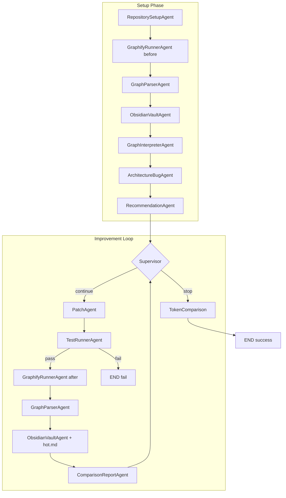
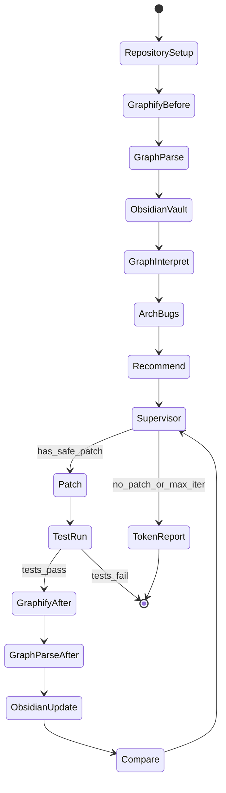
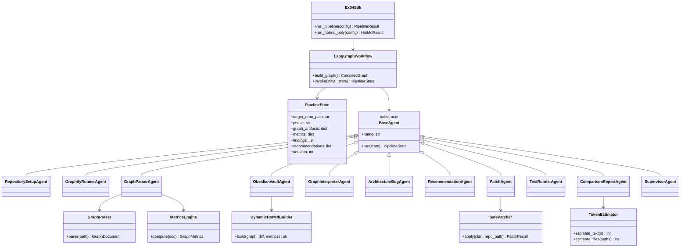

# Technical Architecture Plan — EX04 Graph-Guided Agent System

**Parent:** `docs/PRD.md`  
**Version:** 1.0 (Planning)  
**Date:** June 2026

---

## 1. Overview

Local-first Python system orchestrating Graphify, Obsidian vault generation, architecture analysis, safe patching of `martinpeck/broken-python`, and before/after reporting — implemented as a **LangGraph** multi-agent pipeline with OOP services under `src/`.

---

## 2. Recommended Repository Structure

```
Ai-wdefe3/                          # Assignment project root
├── README.md                       # Final submission (implementation phase)
├── pyproject.toml                  # uv project manifest
├── uv.lock                         # Locked dependencies
├── .env-example                    # LLM_BASE_URL, GRAPHIFY_PATH (no secrets)
├── .gitignore
│
├── src/
│   └── ex04_agent/
│       ├── __init__.py
│       ├── main.py                 # CLI entry (thin)
│       ├── constants.py
│       ├── sdk/
│       │   └── sdk.py              # Single SDK entry: run_pipeline()
│       ├── agents/                 # ≤150 lines each
│       │   ├── base.py
│       │   ├── repository_setup.py
│       │   ├── graphify_runner.py
│       │   ├── graph_parser.py
│       │   ├── obsidian_vault.py
│       │   ├── graph_interpreter.py
│       │   ├── architecture_bug.py
│       │   ├── recommendation.py
│       │   ├── patch.py
│       │   ├── test_runner.py
│       │   ├── comparison_report.py
│       │   └── supervisor.py
│       ├── graph/                  # Graphify domain
│       │   ├── models.py
│       │   ├── parser.py
│       │   ├── metrics.py
│       │   └── collector.py
│       ├── obsidian/
│       │   ├── vault_builder.py
│       │   ├── index_builder.py
│       │   └── hotmd_builder.py    # Dynamic hot.md
│       ├── git/
│       │   └── diff_reader.py
│       ├── token/
│       │   ├── estimator.py
│       │   └── comparison.py
│       ├── patch/
│       │   └── safe_patcher.py
│       ├── workflow/
│       │   ├── state.py
│       │   └── graph.py            # LangGraph definition
│       └── shared/
│           ├── config.py
│           ├── gatekeeper.py       # Optional API gatekeeper
│           └── version.py
│
├── tests/
│   ├── conftest.py
│   ├── unit/
│   │   ├── test_graph_parser.py
│   │   ├── test_metrics.py
│   │   ├── test_hotmd_builder.py
│   │   ├── test_token_estimator.py
│   │   └── ...
│   └── integration/
│       └── test_pipeline_fixtures.py
│
├── docs/                           # Planning (this phase)
│   ├── PRD.md
│   ├── PLAN.md
│       ├── TODO.md
│   └── PRD_*.md
│
├── config/
│   ├── setup.json                  # Paths, weights, limits
│   └── rate_limits.json            # API gatekeeper (if LLM used)
│
├── data/
│   └── target_repo/
│       └── broken-python/          # Cloned martinpeck/broken-python
│
├── artifacts/
│   ├── graph/
│   │   ├── before/
│   │   └── after/
│   ├── patches/
│   └── hotmd/                      # hot.md snapshots
│
├── reports/
│   ├── graphify/
│   ├── agent_runs/
│   ├── architecture/
│   ├── tests/
│   ├── comparison/
│   └── token_efficiency/
│
└── obsidian/                       # Generated vault
    ├── index.md
    ├── hot.md
    ├── nodes/
    ├── clusters/
    └── reports/
```

---

## 3. LangGraph Multi-Agent Architecture

### 3.1 Design principles

- **One agent = one responsibility** (course OOP / single responsibility)
- **Agents orchestrate; services implement** (keep agents ≤150 lines)
- **Shared `PipelineState`** passed through LangGraph
- **Supervisor** owns loop control and stop conditions
- **Deterministic path** always available without LLM

### 3.2 Agent summary

| # | Agent | Reads | Writes |
|---|-------|-------|--------|
| 1 | RepositorySetupAgent | config, git | `data/target_repo/` |
| 2 | GraphifyRunnerAgent | target path | `artifacts/graph/{phase}/` |
| 3 | GraphParserAgent | graph.json | metrics JSON, state |
| 4 | ObsidianVaultAgent | metrics, graph | `obsidian/` |
| 5 | GraphInterpreterAgent | metrics, GRAPH_REPORT | story markdown |
| 6 | ArchitectureBugAgent | metrics, graph | findings list |
| 7 | RecommendationAgent | findings | recommendations, patch_plan |
| 8 | PatchAgent | patch_plan | target repo, patches/ |
| 9 | TestRunnerAgent | target repo | test results |
| 10 | ComparisonReportAgent | before/after state | comparison report |
| 11 | Supervisor | state | routing, stop_reason |

---

## 4. Data Flow Between Agents



**State mutations:**
- Each agent receives `PipelineState`, returns updated copy (immutable pattern preferred)
- Artifact paths are references only — large graphs not duplicated in state
- `findings` and `recommendations` append-only until supervisor clears queue

---

## 5. Local Artifacts by Stage

| Stage | Artifacts |
|-------|-----------|
| RepositorySetup | `reports/architecture/repo_metadata.json` |
| Graphify before | `artifacts/graph/before/{graph.json, graph.html, GRAPH_REPORT.md}` |
| Parse | `reports/architecture/metrics_before.json` |
| Obsidian | `obsidian/index.md`, `obsidian/hot.md`, `obsidian/nodes/*.md` |
| Interpret | `reports/architecture/story_before.md` |
| Bugs | `reports/architecture/findings.json` |
| Recommend | `reports/architecture/recommendations.json` |
| Patch | `artifacts/patches/patch_{n}.diff` |
| Test | `reports/tests/pytest_{phase}.xml` |
| Graphify after | `artifacts/graph/after/*` |
| Compare | `reports/comparison/before_after.md` |
| Token | `reports/token_efficiency/summary.md` |
| Agent trace | `reports/agent_runs/{agent}_{ts}.json` |

---

## 6. Graphify Output Parsing

### 6.1 graph.json schema (defensive)

Expected fields (may vary by Graphify version):

```json
{
  "nodes": [
    {
      "id": "string",
      "label": "string",
      "type": "function|class|file|doc|...",
      "source_file": "path/to/file.py",
      "metadata": {}
    }
  ],
  "edges": [
    {
      "source": "node_id",
      "target": "node_id",
      "label": "calls|imports|implements|...",
      "edge_type": "EXTRACTED|INFERRED|AMBIGUOUS",
      "confidence": 0.0,
      "source_file": "path"
    }
  ]
}
```

### 6.2 Parser pipeline

1. `GraphJsonLoader.load(path)` → validate file exists  
2. `GraphParser.parse(raw)` → `GraphDocument`  
3. `GraphIndexer.build(doc)` → adjacency, by-file index  
4. `MetricsEngine.compute(doc, indexer)` → `GraphMetrics`  
5. Serialize to `reports/architecture/metrics_{phase}.json`

### 6.3 GRAPH_REPORT.md usage

- Extract headings and bullet anomalies via regex (deterministic)
- Do not treat narrative as ground truth — cross-check with `graph.json`

---

## 7. Obsidian Page Generation

### 7.1 index.md

`IndexBuilder`:
- Summarize top 5 communities by size
- List hub candidates with wikilinks
- Link `hot.md`, `reports/graph_summary.md`
- Enforce max length from `config/setup.json`

### 7.2 Wiki pages

`VaultBuilder.create_node_page(node)`:
- Frontmatter: id, type, source_file, phase
- Sections: Summary, Incoming edges, Outgoing edges, Metrics, Investigation notes
- Wikilinks to neighbors

### 7.3 log.md (optional)

- Append-only agent decisions for traceability (PART-B log pattern)

---

## 8. Dynamic hot.md Generation

See `docs/PRD_dynamic_hotmd.md`.

**Flow:**
1. `GitDiffReader.get_changed_files(target_repo)`  
2. `NodeRanker.rank(graph, metrics, changed_files, failing_tests)`  
3. `HotMdRenderer.render(rankings, diff, previous_hotmd_path)`  
4. Write `obsidian/hot.md` + snapshot `artifacts/hotmd/hot_{phase}_{ts}.md`

**Integration:** Called from `ObsidianVaultAgent` and after patch/test nodes.

---

## 9. Before/After Comparison Measurement

### 9.1 Graph metrics delta

| Metric | Before | After | Interpretation |
|--------|--------|-------|----------------|
| Node count | | | Growth/shrink |
| Edge count | | | Coupling change |
| Max degree | | | God node relief? |
| Max betweenness | | | Bottleneck relief? |
| Isolated cluster count | | | Integration |
| Ambiguous edge % | | | Clarity |
| Docs-without-code count | | | Traceability |

`ComparisonReportAgent` writes table + narrative.

### 9.2 Qualitative graph story

- Diff `story_before.md` vs `story_after.md` sections
- Reference `hot.md` rank changes
- Cite test pass/fail

### 9.3 Structural diff (optional stretch)

- Compare top-10 centrality node lists
- Flag nodes that left/entered top-10

---

## 10. Token / Context Size Estimation

See `docs/PRD_token_efficiency.md`.

**Implementation:**
- `TokenEstimator.estimate_file(path)`  
- `ContextBundleBuilder.build_baseline(task)` / `build_guided(task)`  
- Hook in workflow: record files read per agent  
- Final `TokenComparisonReport` in ComparisonReportAgent or dedicated node

**Stop condition (optional):** supervisor may stop early if G3 < 50% of B1 for T1.

---

## 11. Stop Conditions for Improvement Loop

| Condition | Action |
|-----------|--------|
| `iteration >= max_iterations` (default 3) | Stop |
| `patch_plan` empty | Stop |
| Tests fail after patch | Stop with error report |
| No safe recommendations remain | Stop |
| Metric improvement < threshold (2 iterations) | Stop (diminishing returns) |
| User `--dry-run` | Skip PatchAgent |
| `allow_patches=false` | Analysis-only mode |

---

## 12. Error Handling

| Error class | Handling |
|-------------|----------|
| Graphify CLI missing | Fail fast with install instructions |
| graph.json malformed | Log warning; partial parse if possible |
| Git not a repo | Skip diff; centrality-only hot.md |
| Tests not found | Warn; skip test proximity weight |
| Patch apply failure | Rollback file; log; stop loop |
| LLM timeout | Fall back to deterministic templates |
| Agent exception | Record in `state.errors`; supervisor decides retry/skip |

**Pattern:** `Result[T, Error]` or tuple `(success, message)` in services; agents never swallow exceptions silently.

---

## 13. Risks and Mitigations

| Risk | Likelihood | Impact | Mitigation |
|------|------------|--------|------------|
| Graphify Windows install issues | Medium | High | Phase 1 verification; document CLI path |
| broken-python has no/minimal tests | Medium | Medium | Add wrapper tests; document gap |
| 150-line limit with 11 agents | Medium | Medium | Agents thin; logic in services |
| LangGraph learning curve | Low | Medium | Start with linear graph, add loop in Phase 7 |
| Token savings not demonstrable | Medium | Low | Honest report per PRD |
| Over-patching breaks repo | Medium | High | Safe patch whitelist; test gate |
| PDF Part-A empty extract | Low | Low | L07 + PART-B/C cover concepts |

---

## 14. Why LangGraph Over CrewAI

| Criterion | LangGraph | CrewAI |
|-----------|-----------|--------|
| Cyclic workflow | Native conditional edges | Awkward for test→regraph loops |
| State visibility | Explicit `PipelineState` | Hidden crew context |
| Debugging | Per-node traces in `agent_runs/` | Multi-agent chatter harder to replay |
| Course loop | Matches lecturer iteration | Better for parallel role debate |
| Local-first | Works without LLM for routing | Often LLM-heavy for delegation |

**Decision:** LangGraph is the orchestration framework. CrewAI is allowed by EX04 but not used.

---

## 15. Mermaid Workflow Diagram



---

## 16. Mermaid OOP / Class Diagram



---

## 17. SDK Entry Point (Planned)

```python
# src/ex04_agent/sdk/sdk.py (sketch — not implemented yet)
class Ex04Sdk:
    def run_pipeline(self, config: AppConfig) -> PipelineResult: ...
    def run_hotmd_only(self, config: AppConfig) -> HotMdResult: ...
```

CLI (`main.py`):
- `uv run ex04-agent pipeline [--dry-run] [--max-iterations N]`
- `uv run ex04-agent hotmd --phase after`

---

## 18. Configuration (`config/setup.json`)

```json
{
  "version": "1.00",
  "target_repo": "data/target_repo/broken-python",
  "graphify_cli": "graphify",
  "max_iterations": 3,
  "hotmd_weights": {
    "degree": 0.20,
    "betweenness": 0.25,
    "diff_proximity": 0.30,
    "test_proximity": 0.15,
    "ambiguous": 0.05,
    "god_node": 0.05
  },
  "index_max_chars": 4000,
  "allow_patches": false
}
```

---

## 19. Implementation Order

Follow `docs/TODO.md` phases 0–15 sequentially. Do not skip PRD/PLAN approval gates before Phase 2 scaffold.

---

## 20. Related Documents

- `docs/PRD.md` — requirements
- `docs/PRD_graphify_pipeline.md` — Graphify/Obsidian
- `docs/PRD_agent_workflow.md` — agents
- `docs/PRD_token_efficiency.md` — token metrics
- `docs/PRD_dynamic_hotmd.md` — extension
- `docs/TODO.md` — phased tasks
